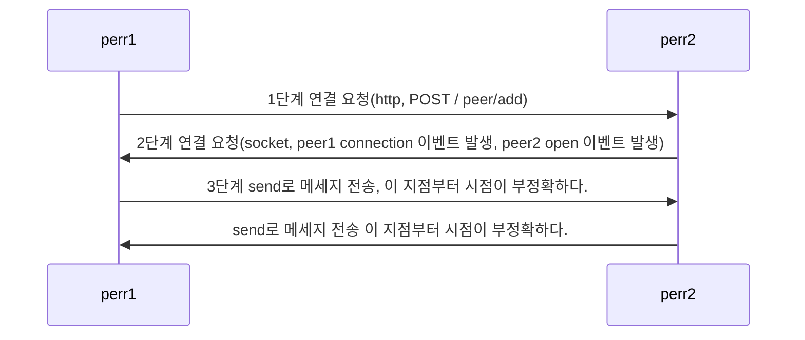

# P2P

- P2P는 소켓 통신을 사용해서 Peer To Peer를 구현한다.

# 연결 방법

- 여기서 perr/add는 라우터로 사용자 마음대로 이름을 정한다.
- perr1->>perr2:send로 메세지 전송, 이 지점부터 시점이

# socket.io VS ws(WebSocket)

- WebSocket : 웹 기반의 소켓 시스템으로 브라우저와 서버 사이에 소켓 통신을 하기 위한 기술

- socket.io : WebSocket을 기반으로 구현된 라이브러리로 WebSocket에 비하여 성능상으로 무겁지만 각종 편의 기능을 제공한다.(채팅방)

| WebSocket                    | socket.io                                         |
| ---------------------------- | ------------------------------------------------- |
| HTML5 웹 표준 기술           | 표준이 아니다. 단순 라이브러리                    |
| 빠르고 데이터 사용이 적다.   | 느리지만 연결이 끊겼을 시 계속 연결을 시도한다.   |
| 단순히 데이터를 전송만 한다. | 채팅방 연결 실패 시 지속 연결 등 기능을 제공한다. |
|                              |

- 웹 소켓 설치 명령어

  npm i ws express -> ws, http 설치

  npm i -D @types/ws @types/express -> ts 전용 ws, express
