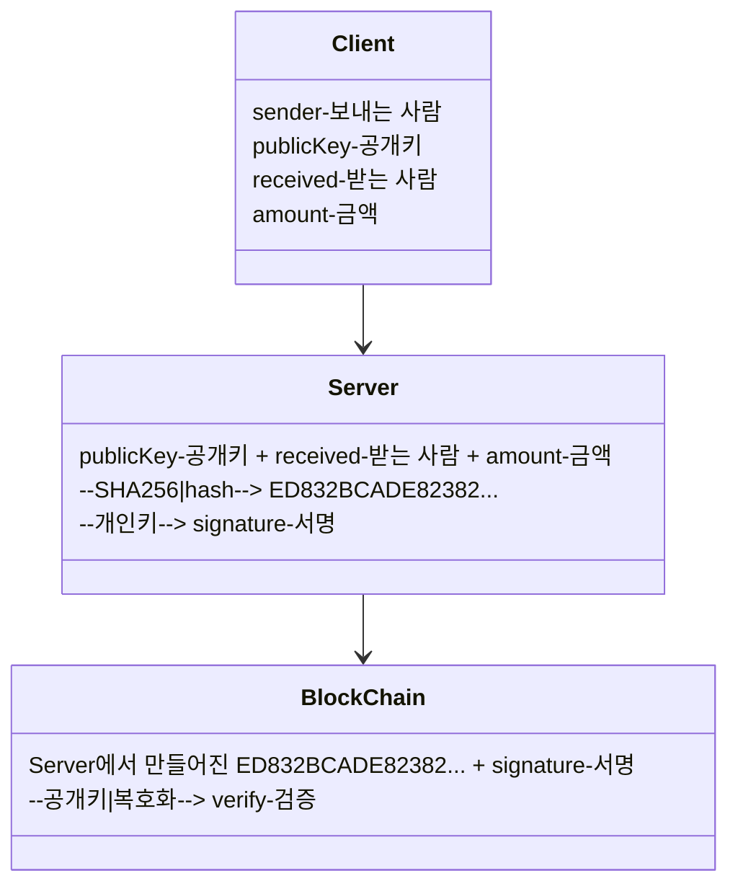

# 지갑 서버

- 지갑 서버와 블록체인 서버를 따로 만드는 이유는 보안 때문으로, 아무나 블록체인에 블록이나 트랜잭션을 추가할 수 없도록 하기 위해서 중간에 서버를 거치는 것이 지갑 서버의 역할

```mermaid
classDiagram
Client --> Server
Server --> BlockChain
class Client{
  sender-보내는 사람
  publicKey-공개키
  received-받는 사람
  amount-금액
}
class Server{
  publicKey-공개키 + received-받는 사람 + amount-금액
  --SHA256|hash--> ED832BCADE82382...
  --개인키--> signature-서명
}
class BlockChain{
 Server에서 만들어진 ED832BCADE82382... + signature-서명
 --공개키|복호화--> verify-검증
}
```

설치해야 될 npm

- npm i elliptic axios
- npm i -D @types/elliptic
