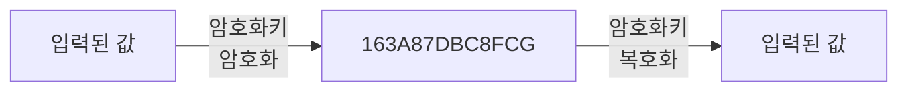
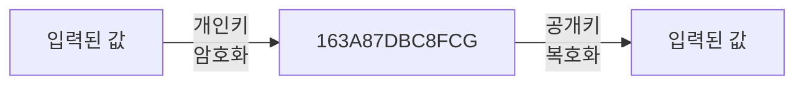
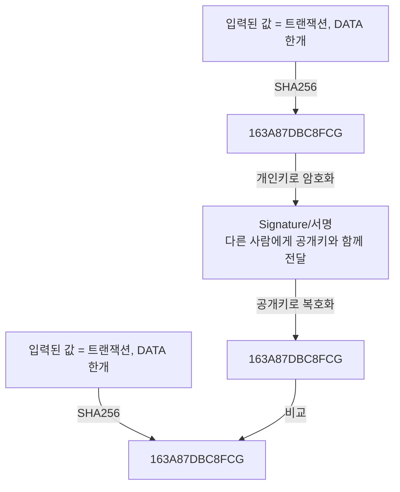

# 블록체인 암호화

- 블록체인에서 신원을 확인하기 위해 양방향 암호화를 사용한다.

- Hash(SHA256)는 단방향 암호화로 복호화가 불가능.

- 양방향 암호화는 암호화 + 복호화 모두 가능

# 비대칭 암호화

- 블록체인에서 사용하는 양방향 암호화는 개인키와 공개키로 이루어진 비대칭 암호화
- 대칭 vs 비대칭

- 대칭 암호화



- 암호화 할 때와 복호화 할 때 같은 키를 사용한다.

- 비대칭 암호화



- 개인키는 안전하게 본관할 수 있으며 암호문과 공개키를 상대에게 공유하여 데이터를 확인할 수 있음
- 공개키로 복호화 할 수 있는 암호문은 연결된 개인키로 생성한 암호문만 가능

# 블록체인에서 어떻게 사용하는가?



1. A~C는 서명, 공개키 만드는 과정 C에서 서명을 하면서 공개키가 발급
2. (A~C) = (E~F) 비교하는 과정

- 공개키는 개인키를 증명하는 개념
- 개인키를 먼저 발행을 하고 이후 공개키로 발행한다.
- 이후 그 개인키의 증명은 개인키가 발행한 공개키로 비교해서 할 수 있음

# 타원곡선

- 타원곡선은 개인키와 공개키를 만들기 위해 사용
- 암호화 알고리즘 중 하나(Elliptic Curve Cryptography = ECC)
- RSA(비대칭 알고리즘)를 사용하지 않고 ECC를 사용하는 이유는 동일한 안정성을 가지면서도 RSA보다 짧은 키를 사용하기 때문이다.
- 휴대폰 등 계산을 많이 할 수 없는 환경(성능이 떨어지는)에서 사용한다.

- 타원곡선에서 사용하는 함수
  - y^2 = x^3 + ax + b
- 비트코인과 이더리움에서 사용하는 함수는

  - y^2 = x^3 + 7

- 타원곡선에서의 덧셈 규칙

  - P + Q + R = 0

- K = 개인키
- KP = 공개키
- -R = P + Q
- 여기서 P + Q 에서 P는 기준점 +는 기준점에서 접선을 긋고 Q는 만나는 접선의 지점이 된다. 그리고 Q 지점의 위치에서 O(수직)라는 반대편 수직으로 내려오고 그 지점이 -R이다. 그것이 개인키가 되며 또 공개키가 된다. 1회 동작 이후 기준점은 계속 바뀐다.즉 -R지점이 새로운 기준점이 되는 것이다.

- 개인키(K)
  - 임의의 점 P를 더하여 새로운 점을 찾은 횟수
- 개인키(KP)
  - P를 K번 더해서 찾은 점
- 기준점(G)
  - 이더리움과 비트코인에서 공개키를 구하기 위해 사용하는 점
  - 기준점 G = 02 79BE667E F9DCBBAC 55A06295 CE870B07 029BFCDB 2DCE28D9 59F2815B 16F81798 (실제로 사용하고 있다.)
- 개인키(K)가 너무 크기 때문에 계산에 있어 알고리즘을 사용한다.
  - Double-And-Add 알고리즘을 사용한다.
  - 타원 곡선 알고리즘을 계산할 때 K가 너무 크기 때문에 빠르게 돌리기 위해 사용한다.
  - 횟수를 2진수로 표기 후 0 또는 1을 더하도록 처리한다.
  - 예) 35 횟수를 예시로 아래의 순서를 진행 했을 때
  - 0. 35는 2진수로 100011
  - 1. 첫 자리의 1부터 시작하여 G를 더한다. 0 \* 2 + G = G
  - 2. 두 번째 자리는 0이기 때문에 G \* 2 = 2G
  - 3. 세 번째 자리는 0이기 때문에 2G \* 2 = 4G
  - 4. 네 번째 자리는 0이기 때문에 4G \* 2 = 8G
  - 5. 다섯 번째 자리는 1이기 때문에 8G \* 2 + G = 17G
  - 6. 여섯 번째 자리는 1이기 때문에 17G \* 2 + G = 35G
- 위의 수식은 "이전 값 \* 2 + (현재 자리의 2진수 0,1) \* G"

- 기준점 자리 수 최대수

  - 개인키가 16진수로 된 64자리의 수 => 16^64 => 의 횟수가 256번 돌리고 끝난다.

- 타원곡선 라이브러리 설치

  - npm i elliptic
  - npm i -D @types/elliptic

- 개인키로 암호화한 것이 서명이다.

# 지갑

- 지갑에서 계정을 생성할 경우 개인키와 공개키를 생성한다.
- 공개키를 사용해서 지갑 주소를 만든다. (이때 비트코인과 이더리움의 주소 사용방법이 나누어진다.)
  - 비트코인
    - 암호화를 여러번 거친 후에 사용한다.
  - 이더리움
    - 뒤에서부터 40자만 사용한다.

```

```
