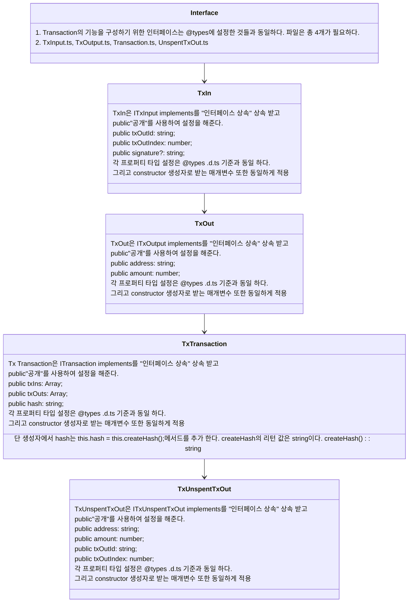
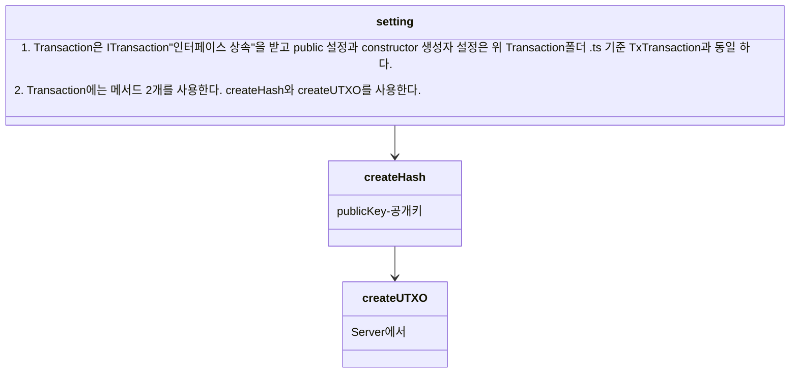

- interface 세팅 및 Tx 기능 설정 @types .d.ts 기준

```mermaid
classDiagram
Interface --> Tx In
Tx In --> Tx Out
Tx Out --> Tx Transaction
Tx Transaction --> Tx UnspentTxOut
class Interface{
 1 .@types 폴더 안에 Tx의 기능들을 만들기 위해 필요한 인터페이스들을 설정해준다.
 2. Tx의 기능을 만들기 위해 필요한 것은 TxInput, TxOutpu, Transaction, UnspentTxOut이 필요하다.
 3. 필요한 것을 각각 declare interface로 인터페이스화 한다. 파일확장자 명은 .d.ts로 만든다.
  예) 파일명 Transaction.d.ts / declare interface ITxOutput 객체


}
class Tx In{
1. Tx In은 transaction에서 사용되는 잔액으로 새로운 트랜잭션이 생성되면 UTO에 있는 내역을 가져와 input이 된다.
2. Tx In에 필요한 프로퍼티는 string 타입 txOutId, number 타입 txOutIndex, string | undefinde 타입 signature이 필요하다.
3. txOutId는 트랜잭션의 해쉬 값 역할을 하기 때문에 string 타입으로 설정 하였다.
4. txOutIndex는 transaction의 몇 번째 output인지 알기 위해서 Index 이름을 붙히고 number 타입으로 설정 하였다.
5. transaction에는 output이 채굴 할 때는 1개가 있고, 거래를 할 때는 상황에 따라 다르지만, 최소 1개 이상이 있게 된다.
6. UTO에서 가져오는 상황에 따라 output 갯 수가 달라짐
7. signature는 최초 채굴"miner"한 상황이 있을 수 있으므로 선택 연산자"프로퍼티? / signature?"를 사용하여 undefined 값을 받을 수 있도록 설정

}
class Tx Out{
1. Tx Out은 transaction의 결과 값으로 새로운 트랜잭션이 발생 되었을 때 UTO에서 내용을 가져올 때 input이 된다.
2. 프로퍼티는 string타입 address와 number타입 amount를 사용한다.
3. address는 채굴자 혹은 거래를 했을 때 본인 or 상대방이 되기 때문에 string 타입으로 설정
4. amount는 채굴 했을 때와 거래를 했을 때 나오는 코인의 수량을 나타내기 때문에 number 타입으로 설정 하였다.
}
class Tx Transaction{
1. Tx Transaction은 위에 인터페이스로 설정한 Tx In과 Tx Out을 배열로 담아서 값을 받기 위해 Tx Transaction를 설정을 한다.
2. Tx Transaction 프로퍼티들은 txIns는 타입 Array<>, txOuts는 타입 Array<>, hash는 string 타입으로 설정 한다.
3. txIns는 [[TxIn],[TxIn],[TxIn],[TxIn]] 형태
4. txOuts는 [[TxOut],[TxOut],[TxOut],[TxOut]] 형태
5. hash는 A245BC4F .... 값을 받기 때문에 string 타입으로 설정
}
class Tx UnspentTxOut{
1. Tx Transaction은 트랜잭션 안에서 채굴 또는 거래 된 상황 이후에 UTO로 넘어가 현재 내역을 보여준다.
2. 그리고 새로운 트랜잭션이 발생할 때 가져오고 거래 하고 남은 잔액은 UTO로 넘어가고 남지 않는다면 소멸이 된다.
3. Tx Transaction 프로퍼티들은 address는 타입 string, amount는 string 타입, txOutId는 string 타입, txOutId는 number 타입
4. address가 string 타입인 이유는 채굴 또는 거래를 한 사용자의 이름을 사용한다. 그래서 string 타입으로 설정
5. amount가 number 타입인 이유는 채굴 또는 거래를 한 사용자의 잔액을 표시한다. 그래서 number 타입으로 설정
6. txOutId가 string 타입인 이유는 transaction의 hash 값을 표시 해주기 때문에 string 타입으로 설정
7. txOutIndex가 number 타입인 이유는 채굴 "새로 1개 생성" 또는 거래 "UTO에서 가져온다."를 했을 때
8. 사용되는 output이 몇번째 output인지 알기 위해서 number 타입을 사용한다. 그리고 output은 배열에 담겨 있다.
}

```

- interface 세팅 및 Tx 기능 설정 Transaction폴더 .ts 기준



- class Transaction 설정


