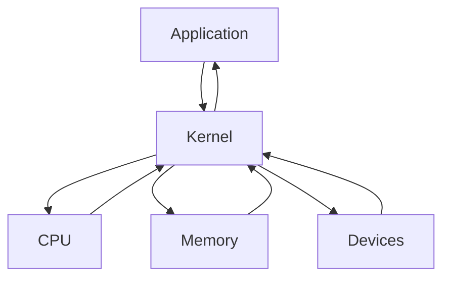

# VM

- Virtual Machine의 약자
- OS 내에서 다른 OS를 설치, 실행하는 프로그램
- 장점 : lppLAYER 등을 포함하는 안드로이드 플레이어, Java에서 사용하는 JVM, Ethereum에서 사용하는 EVM, Windows/Linux/Android등 거의 모든 OS를 설치할 수 있는 VMWare등
- 단점 : 물리적인 컴퓨터, 즉 하드웨어의 성능을 본래의 OS와 나누게 되어 성능 저하를 일으킨다.

# Kernel

- 커널은 하드웨어와 프로그램을 연결해주는 프로그램
- 운영체제(OS)에 포함되어있다.



# WSL

- Windows SubSystem for Linux
- 윈도우에서 Linux OS를 사용하게 해주는 서비스
- Linux OS에는 Ubuntu, Cent Os, Redhat 등이 있음
- Linux(리눅스) : Linux는 Unix 기반의 OS다. MAC OS도 Unix 기반의 OS다.
- WSL은 VM가 차이점
- VM : VM은 OS 상에서 다른 OS를 설치 사용하고, 하드웨어 성능을 나눠서 사용
- WSL : WSL은 Linux의 기반을 설치하지 않고 Windows의 기반을 사용하여 Linux를 실행한다. 즉 WSL은 Linux의 커널을 사용하지 않는다. 그래서 WSL은 성능 저하가 크지 않다. 예전에는 OS충돌이 많이 있었으나 현재는 많은 패치로 충돌이 많이 줄어듬.

# WSL 설치 방법

- 기초 확인 사항

1. Windows 사양에서 버전 21H2을 확인. 20H2면 설치 안됨
2. 제어판 -> 프로그램 추가 제거 -> windows 기능 켜기 / 끄기 -> Linux용 windows 하위 시스템 체크
3. Microsoft Sotre 에서 terminal 설치 (PowerShell)과 같은 걸로 나온다. WSL 사용에 있어 terminal을 설치하여 사용하는 것을 권장

설치 완료 후 관리자 권한으로 터미널 실행 후 설치 명령어

------------- 여기부터 터미널에서 설치 시작 ----------------

1.배포 이미지 관리

```sh
dism.exe /online /enable-feature /featurename:Microsoft-Windows-Subsystem-Linux /all /norestart
```

2.가상 머신 활성화

```sh
dism.exe /online /enable-feature /featurename:VirtualMachinePlatform /all /norestart
```

위 1,2 설치 후 아래의 명령어로 설치 가능한 Linux OS를 확인할 수 있음

3.설치 가능한 리스트

```sh
wsl --list --online
```

4.Ubuntu 설치

```sh
wsl --install -d Ubuntu
```

5.WSL를 사용하기 위해 아래 프로그램 설치 "x64 머신용 최신 WSL2 Linux 커널 업데이트 패키지"

```sh
https://learn.microsoft.com/ko-kr/windows/wsl/install-manual#step-4---download-the-linux-kernel-update-package
```

6.WSL의 버전을 확인하기 위해 아래의 명령어 사용

```sh
wsl -l -v
```

7.WSL 2 버전 사용하기

```sh
wsl --set-version Ubuntu 2
```

8.터미널에서 Ubuntu 여는 명령어

```sh
wsl
```

9.터미널에서 Ubuntu 나갈 때 명령어

```sh
exit
```

\*. 터미널로 wsl 실행과 ubuntu 실행 했을 때 차이점
터미널 wsl 실행 : 경로가 Users에서 시작
------------- 여기까지 터미널 설치 작업 끝 ------------------

------------- 여기부터 우분투에서 설치 시작 ----------------

ubuntu 실행 : 최상단 Root에서 시작

# ubuntu 명령어

- cd

  - 폴더 이동
  - / : Root 경로(최상위 경로)
  - ~ : Home 경로(/home/사용자 이름)

- mkdir 폴더명 : mkdir 명령어를 입력하면 루트 폴더 기준 점에서 폴더 생성 예) mkdir test => test 폴더가 생성 됨

- pwd : 현재 경로 출력

- ls

  - 현재 폴더의 내용을 출력
  - 옵션으로 대표적으로 a와 l을 사용
  - ls -al : 권한 용량 등 모든 파일/폴더를 출력(숨긴 파일 포함)

- clear : 화면 초기화

- curl : 인터넷 접근 (요청) \* 자주 사용

- chmod : 777

# Node.js

- 설치

```sh
sudo apt-get update
sudo apt-get upgrade
sudo apt-get install nodejs
```

# nvm 설치 방법

- nvm : Node Version Manager
- Ubuntu에서 Node.js는 최신 버전으로 설치되지 않는다. nvm을 설치하여 해결한다. nvm은 Node.js의 버전을 관리한다.
- 설치 주소 nvm https://github.com/nvm-sh/nvm
- 설치 : curl -o- https://raw.githubusercontent.com/nvm-sh/nvm/v0.39.3/install.sh | bash (nvm을 먼저 설치 해야지 NodeJs를 설치할 수 있도록 인식함)
- nvm install 18.12.1 는 Node.js 버전 설치
- nvm use 18.12.1 는 18.12.1 버전을 사용한다는 의미

# nvm의 명령어

- nvm ls-remote : 설치 가능한 Node.js의 모든 버전을 보여줌

- node -v : 현재 버전 확인

# WSL에서 Ubuntu를 삭제하고 싶을 때

```sh
 wsl --unregister Ubuntu
```

# GETH를 위한 세팅

- geth : GO로 구현된 이더리움 서버

# Golang

- Google에서 개발한 프로그래밍 언어(컴파일 언어)
- 이름은 Go 이지만 검색 등 불편하여 Golang이라고 부른다.
- 고랭 설치

```sh
sudo apt-get install golang
```

- 버전 확인

```sh
go version
```

- 아래의 프로그램들을 함께 설치한다.
- libgmp3-dev : 다중 정밀도 산술 라이브러리
- tree : 디렉토리를 tree 형태로 보여준다. (잘못 사용하면 큰일이 일어남)
- make : 통합 컴파일러, 다양한 언어에 대해서 알아서 bulid를 해준다.
- bulid-essential : build에 필요한 기본 라이브러리들을 제공

```sh
sudo apt-get install libgmp3-dev tree make build-essential
```

# Go-Etherreum

- geth 폴더 생성후 geth 폴더 안에서 Go-Etherreum를 설치
- Go-Etherreum는 이더리움에서 제공하는 공식 소프트웨어
- 설치 명령어

```sh
git clone https://github.com/ethereum/go-ethereum
```

- build(빌드)

  - go-ethereum 폴더에서 아래 명령어 실행

  ```sh
  make all
  ```

- go-ethereum/build/bin 폴더 내에서 geth 실행
- geth 실행

```sh
./geth
```

# 생성한 geth를 위치에 상관없이 명령어로 사용할 수 있도록 설정

- pwd로 확인한 geth의 경로
- ubuntu프로그램 실행 상태에서 /home/wg86/geth/go-ethereum/build/bin 경로에 들어가 .bash_profile 이름으로 파일을 생성한다.
- 방법은 vi (텍스트를 편집하는 기능, 만들기도 할 수 있다.)

- vi 명령어를 사용하여 파일을 생성
- ~ (home) / (root)

```sh
vi ~/.bash_profile
```

- 파일이 생성 되고 파일이 열리면 아래 명령어를 입력

```sh
export PATH=$PATH:/home/wg86/geth/go-ethereum/build/bin
```

- 명령어 입력 후 수정 완료 시 esc 하고 :wq! 하고 엔터
- 여기서 wq! 중에서 w는 저장, q는 나가기, !는 강제한다.

```sh
source ~/.bash_profile
```

- source는 어디서든지 geth 명령어로 geth 실행가능

```sh
source ~/.bashrc
```

- geth 명령어만으로 실행 시 기본적으로 mainet에 접근하도록 되어있다.

```sh
Cahin ID: 1(mainet)
```

# private Etherreum Network

- 개인 이더리움 서버를 연다.
- genesis.json 파일을 만들어서 기본 설정을 입력한다.

```json
{
  "difficulty": "200000",
  "gasLimit": "3100000",
  "alloc": {
    "0xA3e9Ab71E70086fd470587428aF5c9a003CA0338": {
      "balance": "100000000"
    },
    "config": {
      "chainId": 50,
      "homesteadBlock": 0,
      "eip150Block": 0,
      "eip155Block": 0,
      "eip158Block": 0
    }
  }
}
```

# nvm 실행 오류 시

```sh
# Ubuntu 실행 후 아래 명령어들 입력
source ~/.bashrc
nvm
 nvm install 본인nodejs 버전 # 예) nvm install 18.13.0
```
