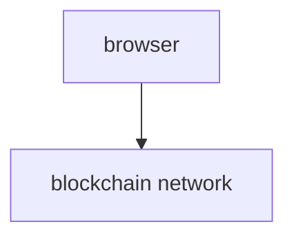
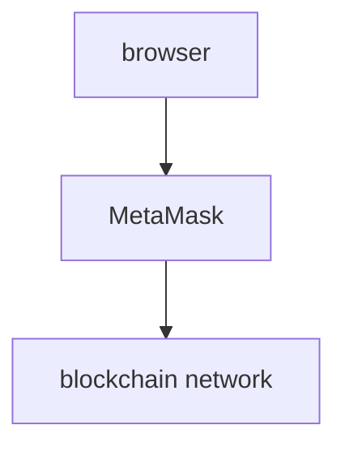

# Web3

- World Wide Web의 세대중 하나.

## Web1

- World Wide Web의 1세대
- html를 사용한 정적 웹페이지
- DB 없이 파일에 데이터를 저장을 하여 사용자가 데이터를 수정하기 어려웠다. 대표적으로 과거 야후 홈페이지가 있었음.
- GIF 파일을 사용한 버튼과 그래픽을 사용
- Web1 1세대는 읽기 전용 웹

## Web2

- World Wide Web의 2세대
- 데이터를 일괄적으로 검색, 분류가 가능하여 대표적으로 위키백과 등이 있다.
- 사용자의 입력에 따라 웹페이지가 변화하여 사용자가 데이터를 수정하기 쉬워졌다. 대표적으로 블로그(글쓰기) 등이 있다.
- API 통신 사용
- Web2 2세대는 참여형 소셜 웹이다.

## Web3

- World Wide Web의 3세대
- 3D 그래픽, 탈중앙화(블록체인) 등
- 사용자의 검색 or 분석을 통해 컨텐츠를 생성 or 공유 or 연결 한다.
- 중간자를 통해 공개 || 비공개로 사용할 수 있어서 신뢰할 수 없는 데이터를 제공한다. 그래서 익명성으로 개인 정보를 더 안전하게 저장이 가능하다. 읽고 쓰고 실행하는 웹페이지가 있다.
- Web3 3세대는 현재 나오고 있고 발전하고 있는 모든 기술을 포함하여 개념이 애매하다.

# Metamask In Javascript

- Web3 라이브러리를 사용하기 전에 메타마스크에서 기본적으로 제공해주는 객체부터 사용을 해보고 감을 익힌다.

  - 수업 중에 블록체인 네트워크는 가나슈를 사용한다.
  - Ubuntu를 실행시 글씨 색상에 회색이면 아래 명령어를 입력

  ````sh
  souce ~/.bashrc # 이것을 입력해야 노드 버전이 18.13 버전으로 바뀜

  ```
  ````

- metamask 자체 제공을 해주는 객체로 확장 프로그램 metamask에 들어가 "사이트 액세스" 항목에서 모든 사이트에서로 설정 해준다.
- 아래의 ethereum 객체는 어디까지나 메타마스크 확장 프로그램에 연결된다.

- axios를 사용한 요청 방식



- ethereum를 사용한 요청 방식



- MetaMask는 중개자 역할로 browser가 서버에 요청을 하면 MetaMask에서 요청 받은 것을 blockchain network에 연결 된 서버 (메인넷, 가나슈, 테스트서버 등등)으로 요청을 보낸다.
- Web3 라이브러리 사용하는 이유는 보안상의 안전하기 때문이다.

- 메타 마스크 객체 metamask.js파일

```js
console.log(window.ethereum);
```

- 메타 마스크 연결 확인 metamask.js파일

```js
window.ethereum.isConnected();
```

- 이벤트 등록 metamask.js파일

```js
ethereum.on("connect", (connectInfo) => {
  console.log(connectInfo);
  console.log(parseInt(connectInfo.chainId));
});
```

- connect : 연결됐을 때 실행 하겠다.

```js
ethereum.on("connect", handler : (connectInfo :{ chainId : string;
}) => void);
```

- disconnect : 연결이 끊겼을 때

```js
ethereum.on("connect", handler : (error :ProviderRpcError) => void) interface ProviderRpcError extends Error{
    message: string; // 메세지는 string 타입
    code: number; // 코드는 number 타입
    data?: unknown; // 데이터는 뭐가 들어올지 몰라 선택 연산자 사용
}
```

- MetaMask에서 계정들을 사이트에 연결 해야됨

- accountsChanged : 계정 변경되었을 때

```js
ethereum.on("accountsChanged", handler : (accounts:Array<string>) => void)
```

- chainChanged : 블록체인 네트워크(체인)가 변경되었을 때

```js
ethereum.on("chainChanged", handler : (chainId:string) => void)
```

- 메타마스크에 RPC 요청

```js
ethereum.request({
  method: "eth_getBalance",
  params: ["0xdA1E098081C3C581c4549AA8c972D6C4EF22FA02"],
});
```

- eth_getBalance (잔액조회)

```js
const args = {
  method: "eth_getBalance",
  params: ["지갑 주소"],
};
```

- eth_chainId (체인 아이디 조회)

```js
const args = {
  method: "eth_chainId",
};
```

- eth_requestAccounts (메타마스크 프로그램의 계정 지갑주소 조회)
- 보안 정책의 문제로 현재 선택한 계정 주소만을 가져온다.
- Javascript에서 보여주기 위해

```js
const args = {
  method: "eth_requestAccounts",
};
```
