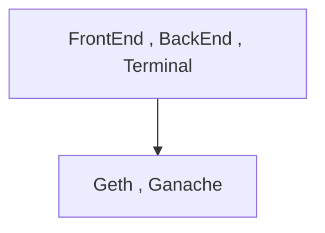
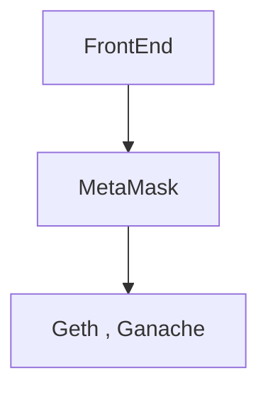
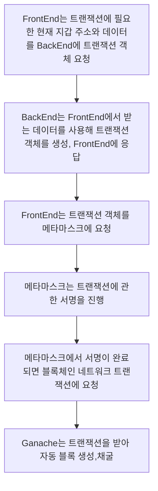

# BlockChain NetWork

## Geth

Geth는 블록체인 네트워크 서버 중 하나

- 특징
  - Genesis 블록부터 설정 가능하다.
  - IPC를 사용하여 접근 가능
  - RPC를 설정하여 메서드 사용이 가능
  - 다른 피어와 동기화가 가능하다. (Chain ID로 같은 블록체인 네트워크인지 확인)
  - attach 명령어로 블록체인 네트워크에 접근 가능
  - 트랜잭션 보낼 때 unlock을 풀어야 보낼 수 있다.

## Ganache

Ganache는 블록체인 네트워크 서버 중 하나

- 특징
  - 테스트가 바로 가능할 정도로 블록체인 네트워크 생성이 자동화 되어있다.
  - 다른 피어를 찾지 않는다. (같은 블록체인 네트워크여도 동기화를 하지 않는다.)
  - 자동 채굴을 한다. (트랜잭션 발생 시 마이닝"채굴"을 하지 않아도 트랜잭션이 업데이트 된다.)
  - 기본적으로 모든 내부 지갑 계정이 unlock이 되어있어 트랜잭션 보낼 때 unlock을 하지 않아도 보낼 수 있음

# Transaction 보내는 방법

## Geth attach 명령어를 사용하여 블록체인 네트워크에 접근

- IPC 또는 HTTP, WS 등 블록체인 네트워크에 직접 접근(접속)하여 RPC를 사용한다.
- 블록체인 네트워크 내에서 트랜잭션을 바로 추가한다.

```sh
geth attach http://localhost:8545 # 블록체인 네트워크 실행 후 우분투 새창을 열어 이 명령어를 실행

eth.sendTransaction({from:eth.accounts[0], to:eth.account[1], value:web3.toWei(1,'ether')}) # 이후 트랜잭션 보냄
```

## CURL 명령어를 사용하여 API 요청

- Windows CMD | PowerShell 등에서 CURL 명령어를 사용한다.

- RPC와 유사하지만 충첩되서 사용할 수 없다.
- RPC를 사용한 위에서는 eth.sendTransaction과 eth.accounts를 한 줄에 모두 사용이 되지만 curl에서는 그것이 안된다.

```bash
curl -X POST -H "content-type: application/json" --data '{"id": 1337, "jsonrpc": "2.0", "method": "eth_sendTransaction", "params": [{"from": "0x....", "to": "0x....", "value": "0x.....":}]}' http://localhost:8545
```

## AXIOS 라이브러리를 사용하여 API 요청

- HTML, React 등에서 사용하는 방법으로 curl과 유사하다.

```js
axios.post("http://localhost:8545", {
  id: 1337,
  jsonrpc: "2.0",
  method: "eth_sendTransaction",
  params: [
    {
      from: "0x....",
      to: "0x....",
      value: "0x....",
    },
  ],
});
```

## Web3 사용

Web3는 블록체인 네트워크에 맞추어 구현된 라이브러리다.

```js
web3.eth.sendTransaction({
  from: "0x....",
  to: "0x....",
  value: "0x....",
});
```

# Transaction 보내는 방식

## 블록체인 네트워크에 바로 접근



- Geth attach

## MetaMask를 사용하여 접근



```js
const web3 = new Web3(window.ethereum);
```

## BackEnd 서버를 사용



- BackEnd 서버를 사용시 장점
  - 스마트 컨트랙트 데이터를 숨길 수 있다.
