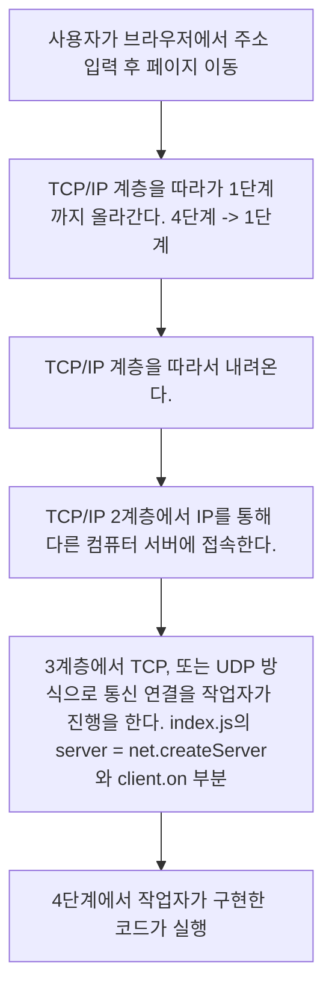
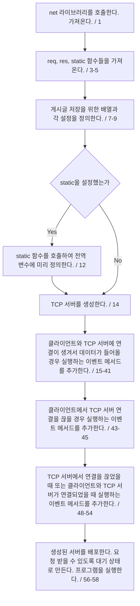
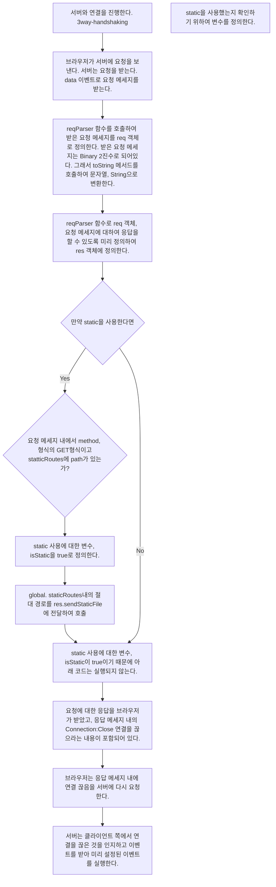
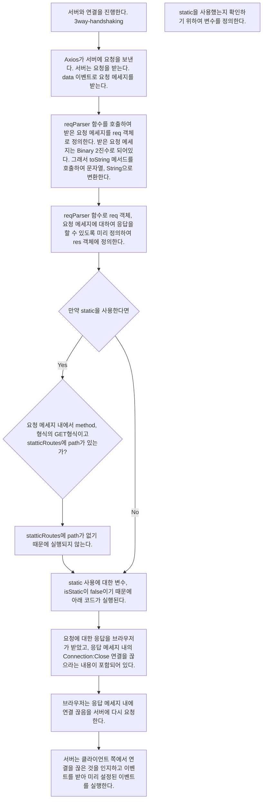

# TCP에서의 흐름

```mermaid
flowchart
A[사용자가 브라우저에서 주소 입력 후 페이지 이동] --> B;
B[TCP/IP 계층을 따라가 1단계까지 올라간다. 4단계 -> 1단계] --> C
C[TCP/IP 계층을 따라서 내려온다.] --> D;
D[TCP/IP 2계층에서 IP를 통해 다른 컴퓨터 서버에 접속한다.] --> E;
E[3계층에서 TCP, 또는 UDP 방식으로 통신 연결을 작업자가 진행을 한다. index.js의 server = net.createServer와 client.on 부분 ] --> F
F[4단계에서 작업자가 구현한 코드가 실행]

```

# 구현된 코드 흐름

```mermaid
flowchart
A[net 라이브러리를 호출한다. 가져온다. / 1] --> B
B[req, res, static 함수들을 가져온다. / 3-5] --> C
C[게시글 저장을 위한 배열과 각 설정을 정의한다. / 7-9] --> D
D{static을 설정했는가} -->|Yes| J
J[static 함수를 호출하여 전역 변수에 미리 정의한다. / 12] --> E
D --> |No| E
E[TCP 서버를 생성한다. / 14] --> F
F[클라이언트와 TCP 서버에 연결이 생겨서 데이터가 들어올 경우 실행하는 이벤트 메서드를 추가한다. / 15-41] --> G
G[클라이언트에서 TCP 서버 연결을 끊을 경우 실행하는 이벤트 메서드를 추가한다. / 43-45] --> H
H[TCP 서버에서 연결을 끊었을 때 또는 클라이언트와 TCP 서버가 연결되었을 때 실행하는 이벤트 메서드를 추가한다. / 48-54] --> I
I[생성된 서버를 배포한다. 요청 받을 수 있도록 대기 상태로 만든다. 프로그램을 실행한다. / 56-58]
```

# 브라우저에서 접속했을 때 흐름

```mermaid
flowchart TD
A[서버와 연결을 진행한다. 3way-handshaking]
B[브라우저가 서버에 요청을 보낸다. 서버는 요청을 받는다. data 이벤트로 요청 메세지를 받는다.]
C[reqParser 함수를 호출하여 받은 요청 메세지를 req 객체로 정의한다. 받은 요청 메세지는 Binary 2진수로 되어있다. 그래서 toString 메서드를 호출하여 문자열, String으로 변환한다.]
D[reqParser 함수로 req 객체, 요청 메세지에 대하여 응답을 할 수 있도록 미리 정의하여 res 객체에 정의한다. ]
E[static을 사용했는지 확인하기 위하여 변수를 정의한다.]
F{만약 static을 사용한다면}
F -->|Yes| F1 --> F2 --> F3 --> G
F -->|No| G
F1{요청 메세지 내에서 method, 형식의 GET형식이고\nstatticRoutes에 path가 있는가?}
F2[static 사용에 대한 변수, isStatic을 true로 정의한다.]
F3[global. staticRoutes내의 절대 경로를 res.sendStaticFile에 전달하여 호출]
G[static 사용에 대한 변수, isStatic이 true이기 때문에 아래 코드는 실행되지 않는다.]
H[요청에 대한 응답을 브라우저가 받았고, 응답 메세지 내의 Connection:Close 연결을 끊으라는 내용이 포함되어 있다.]
I[브라우저는 응답 메세지 내에 연결 끊음을 서버에 다시 요청한다.]
J[서버는 클라이언트 쪽에서 연결을 끊은 것을 인지하고 이벤트를 받아 미리 설정된 이벤트를 실행한다.]

A-->B-->C-->D-->F
G-->H-->I-->J
```

# AXIOS 요청에 대한 흐름

```mermaid
flowchart TD
A[서버와 연결을 진행한다. 3way-handshaking]
B[Axios가 서버에 요청을 보낸다. 서버는 요청을 받는다. data 이벤트로 요청 메세지를 받는다.]
C[reqParser 함수를 호출하여 받은 요청 메세지를 req 객체로 정의한다. 받은 요청 메세지는 Binary 2진수로 되어있다. 그래서 toString 메서드를 호출하여 문자열, String으로 변환한다.]
D[reqParser 함수로 req 객체, 요청 메세지에 대하여 응답을 할 수 있도록 미리 정의하여 res 객체에 정의한다. ]
E[static을 사용했는지 확인하기 위하여 변수를 정의한다.]
F{만약 static을 사용한다면}
F -->|Yes| F1 --> F2 --> G
F -->|No| G
F1{요청 메세지 내에서 method, 형식의 GET형식이고\nstatticRoutes에 path가 있는가?}
F2[statticRoutes에 path가 없기 때문에 실행되지 않는다.]
G[static 사용에 대한 변수, isStatic이 false이기 때문에 아래 코드가 실행된다.]
H[요청에 대한 응답을 브라우저가 받았고, 응답 메세지 내의 Connection:Close 연결을 끊으라는 내용이 포함되어 있다.]
I[브라우저는 응답 메세지 내에 연결 끊음을 서버에 다시 요청한다.]
J[서버는 클라이언트 쪽에서 연결을 끊은 것을 인지하고 이벤트를 받아 미리 설정된 이벤트를 실행한다.]

A-->B-->C-->D-->F
G-->H-->I-->J
```
